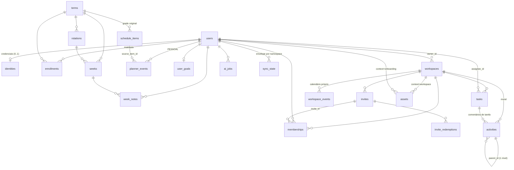

# ESTUDY — Modelo de dados (v2)

> Especificação vigente do banco. Substitui a §7 de `docs/referencia/ESTUDY-DATABASE-v1.md`,
> que foi usada como ponto de partida e corrigida onde o código real (`reference/planner_aluno026.html`)
> diverge dela. As divergências e o porquê de cada mudança estão em [`AUDITORIA.md`](AUDITORIA.md).
> O dicionário de colunas no fim deste arquivo foi **gerado do próprio banco**.

## 1. Visão geral

PostgreSQL 16 · 30 tabelas · 13 enums · 25 funções `api.*` · 46 policies de RLS · 29 triggers · 11 migrations.

Dois domínios **sem nenhuma FK entre si** (regra §5.1 — verificado por teste no catálogo):

| Domínio | Tabelas | Quem vê |
|---|---|---|
| **Identidade** | `users`, `identities` | perfil: o próprio + quem divide workspace · credenciais: só o dono |
| **Semestre** (referência) | `terms`, `rotations`, `weeks`, `schedule_items`, `enrollments` | grade oficial: todos · plano importado: só o dono |
| **Planner** (pessoal) | `planner_events`, `week_notes`, `user_goals` | só o dono |
| **Workspace** (colaborativo) | `workspaces`, `memberships`, `invites`, `invite_redemptions`, `workspace_events`, `tasks`, `assets`, `activities` | membros ativos; escrita pela matriz de papéis |
| **Plataforma** | `sync_state`, `domain_events` (outbox), `ai_jobs` | interno |
| **Constantes** | `activity_type_meta`, `presence_status_meta`, `task_status_meta`, `role_permissions`, `modules`, `workspace_colors`, `workspace_icons`, `asset_ext_meta`, `domain_event_catalog` | leitura |

## 2. Diagrama



## 3. Decisões de modelagem

1. **Semanas pertencem a um ciclo (`terms`), não são globais.** O app recria as semanas ao importar um plano por IA
   (S01…S60, módulo `GERAL`, L3092-3101). A grade oficial 2026.2 é um `term` com `owner_user_id NULL`;
   um plano importado é um `term` do próprio aluno (`import:<user_id>`). `weeks.id = '<term>:<Sxx>'`.
2. **A grade original fica em `schedule_items`** e cada evento do aluno aponta para a linha de origem
   (`planner_events.source_item_id`). Isso sustenta "Restaurar agenda original" (`api.restore_baseline`)
   e a reimportação da grade sem destruir o que o aluno criou (regra §5.9).
3. **`origin` substitui a heurística do texto da nota**; `custom` virou coluna gerada (`origin IN ('manual','sugestao')`),
   mantendo o contrato do app.
4. **Presença é enum de 4 estados** + `attendance_marked_at` (registro retroativo). `done` não é coluna:
   o `ns_get` o devolve derivado (`status = 'presente'`) porque o app ainda lê o legado (L706).
5. **`subject`** (matéria) é coluna gerada por `subject_of(title)`, idêntica ao `subjectOf` do app (L708).
6. **Metas:** `gym_per_week` = nº de eventos ACADEMIA; `study_hours_per_week` = **horas** de ESTUDO (a v1 dizia "blocos").
7. **Comentário é Activity** com `task_id` como FK real (CASCADE) em vez de alvo polimórfico solto;
   `target_type`/`target_id` da v1 continuam existindo como colunas geradas.
8. **Todo arquivo é Asset** — inclusive os do onboarding (`context='onboarding'`, sem workspace). `jpg` e `jpeg` são aceitos (o app grava os dois).
9. **Exclusão lógica** (`deleted_at`) em tudo que o app apaga, para o sync não "ressuscitar" linhas.
   Exclusão física de workspace faz CASCADE (o app deixa órfãos, L2526).
10. **Permissões:** `memberships.permissions` é snapshot **sempre** rederivado de `role` por trigger — nunca vem do cliente.
    O dono é `workspaces.owner_id`; só ele tem membership `owner` (índice único parcial).
11. **Remoção de membro é lógica** e a unicidade é parcial (`WHERE status='active'`), permitindo reentrar.
12. **Convite:** código único sem diferenciar maiúsculas; `workspaces.invite_code` é só cópia de exibição e
    `ensure_workspace_invite()` garante que sempre exista um convite real para ele.
13. **Outbox por trigger** (`domain_events`, nomes do catálogo do Bus): o Bus do cliente não emite em
    "marcar tudo presente" nem "aplicar sugestões", então o banco é a fonte confiável dos Domain Events.
14. **Ids `TEXT`** para preservar os ids curtos do app (`'e'+base36`) e os uuids — sem quebrar referências na migração.

## 4. Regras de negócio → onde o banco garante

| Regra (§5 da v1) | Garantia | Teste |
|---|---|---|
| 1. Planner pessoal × workspace colaborativo | nenhuma FK cruzada; RLS por `user_id` × por membership | 01, 04 |
| 2. Presença = ciclo de 4 estados, idempotente | enum `presence_status`; `api.cycle_attendance`, `api.set_attendance` | 02 |
| 3. Dia livre (**corrigida**: duas definições) | `api.day_overview` → `is_empty_day` e `is_free_of_official` | 02 |
| 4. Todo arquivo é Asset; pdf/docx/jpg/jpeg/png | enum `asset_ext`; `ai_status` default `pendente` | 03, 05 |
| 5. Comentário é Activity, thread | `activities` + trigger de pai raiz (1 nível, sem ciclos) | 03, 06 |
| 6. Convite único; expiração/limite | índice `upper(code)`; `api.redeem_invite` (not_found/inactive/expired/exhausted) | 03 |
| 7. Permissões derivam do papel | trigger `trg_membership_derive`; `api.has_permission`; RLS | 03, 04, 05 |
| 8. `u_me` proibido | CHECK em `users.id`; `valid_user_id()` no sync | 02 |
| 9. `custom` preserva reimportação | `origin` + `source_item_id`; `api.enroll_user` idempotente | 02 |
| 10. Metas padrão 4 / 10 | defaults + CHECK 0–7 / 0–40 | 02 |

## 5. API (schema `api`)

Toda função que recebe `p_user` exige `SET LOCAL estudy.user_id = p_user` na transação (senão 42501).

| Função | Para quê |
|---|---|
| `ns_get(user, ns)` / `ns_put(user, ns, envelope)` | contrato `window.storage` do app (§6) |
| `ns_import(user, ns, envelope)` | carga do localStorage — **só `estudy_admin`** |
| `enroll_user(user, term, student_code)` | matricula e materializa a grade (idempotente) |
| `restore_baseline(user)` | "Restaurar agenda original" |
| `cycle_attendance`, `set_attendance`, `mark_day_present` | check-in |
| `attendance_stats`, `attendance_by_subject`, `pending_checkins` | presença (pct = (presente+justificada)/registrados; risco < 75%) |
| `day_overview`, `empty_days_remaining`, `weekly_goal_progress` | visão geral, janelas livres, metas |
| `create_workspace`, `redeem_invite`, `revoke_invite`, `set_my_responsibility` | colaboração |
| `is_member`, `has_permission`, `shares_workspace`, `visible_workspaces`, `current_user_id`, `next_status` | apoio às policies |
| `purge_mocks()` | exclusão lógica dos workspaces de exemplo — **só `estudy_admin`** |

## 6. Contrato de sincronização

```
GET /ns/:name → api.ns_get(user, name)          → {v, at, data}  (shape exato do app)
PUT /ns/:name → api.ns_put(user, name, envelope) → relatório {applied, skipped[], warnings[], readOnly[], ...}
```

- **Versões aceitas:** identity 2 · users 1 · planner 2 · workspace 3 · memberships 1 · invites 1. Outra versão → 22023 (o app migra antes de gravar).
- **Forma:** `data` precisa ter a chave principal do namespace (`events`, `workspaces`, `items`…); payload parcial nunca apaga dados.
- **Item ruim não derruba o namespace:** vai para `skipped` com o motivo.
- **Conflito:** last-write-wins por namespace (`at`, limitado a now()+5min; lock consultivo por usuário/namespace).
  No workspace há proteção por linha: o que **outro membro** criou/alterou depois do seu último GET não é apagado nem sobrescrito (`conflict_newer_on_server`).
- **Autoria em runtime** é sempre o usuário da sessão; dono do workspace nunca muda por sync; removido/revogado não volta por cópia antiga.
- **Mocks:** um aluno novo recebe `{workspaces: []}` — o app não semeia os workspaces de exemplo.

## 7. Dicionário de dados (gerado do banco)

#### `activity_type_meta`

| coluna | tipo | nulo | padrão |
|---|---|---|---|
| `type` | activity_type | — |  |
| `label` | text | — |  |
| `color` | text | — |  |
| `bg` | text | — |  |
| `css_token` | text | — |  |
| `is_academic` | boolean | — |  |
| `sort_order` | smallint | — |  |

#### `presence_status_meta`

| coluna | tipo | nulo | padrão |
|---|---|---|---|
| `status` | presence_status | — |  |
| `label` | text | — |  |
| `mark` | text | — |  |
| `next` | presence_status | — |  |
| `counts_as_present` | boolean | — |  |
| `sort_order` | smallint | — |  |

#### `task_status_meta`

| coluna | tipo | nulo | padrão |
|---|---|---|---|
| `status` | task_status | — |  |
| `label` | text | — |  |
| `css_token` | text | — |  |
| `sort_order` | smallint | — |  |

#### `role_permissions`

| coluna | tipo | nulo | padrão |
|---|---|---|---|
| `role` | member_role | — |  |
| `label` | text | — |  |
| `permissions` | jsonb | — |  |
| `sort_order` | smallint | — |  |

#### `modules`

| coluna | tipo | nulo | padrão |
|---|---|---|---|
| `code` | text | — |  |
| `name` | text | — |  |

#### `workspace_colors`

| coluna | tipo | nulo | padrão |
|---|---|---|---|
| `token` | text | — |  |
| `hex` | text | — |  |
| `sort_order` | smallint | — |  |

#### `workspace_icons`

| coluna | tipo | nulo | padrão |
|---|---|---|---|
| `icon` | text | — |  |
| `sort_order` | smallint | — |  |

#### `asset_ext_meta`

| coluna | tipo | nulo | padrão |
|---|---|---|---|
| `ext` | asset_ext | — |  |
| `color` | text | — |  |
| `mime` | text | — |  |

#### `domain_event_catalog`

| coluna | tipo | nulo | padrão |
|---|---|---|---|
| `name` | text | — |  |
| `emitted_by_app` | boolean | — |  |
| `description` | text | — | ''::text |

#### `users`

| coluna | tipo | nulo | padrão |
|---|---|---|---|
| `id` | text | — |  |
| `display_name` | text | — | ''::text |
| `avatar_url` | text | sim |  |
| `course` | text | — | ''::text |
| `institution` | text | — | ''::text |
| `is_mock` | boolean | — | false |
| `created_at` | timestamp with time zone | — | now() |
| `updated_at` | timestamp with time zone | — | now() |

#### `identities`

| coluna | tipo | nulo | padrão |
|---|---|---|---|
| `user_id` | text | — |  |
| `username` | citext | sim |  |
| `email` | citext | sim |  |
| `full_name` | text | — | ''::text |
| `period` | text | — | ''::text |
| `provider` | auth_provider | sim |  |
| `provider_subject` | text | sim |  |
| `pass_hash` | text | sim |  |
| `pass_algo` | text | sim |  |
| `onboarded` | boolean | — | false |
| `onboarded_at` | timestamp with time zone | sim |  |
| `signed_in` | boolean | — | false |
| `created_at` | timestamp with time zone | — | now() |
| `updated_at` | timestamp with time zone | — | now() |

#### `terms`

| coluna | tipo | nulo | padrão |
|---|---|---|---|
| `id` | text | — |  |
| `label` | text | — |  |
| `source` | plan_source | — |  |
| `owner_user_id` | text | sim |  |
| `course` | text | — | ''::text |
| `institution` | text | — | ''::text |
| `start_date` | date | sim |  |
| `end_date` | date | sim |  |
| `created_at` | timestamp with time zone | — | now() |
| `updated_at` | timestamp with time zone | — | now() |

#### `rotations`

| coluna | tipo | nulo | padrão |
|---|---|---|---|
| `id` | text | — |  |
| `term_id` | text | — |  |
| `code` | text | — |  |
| `label` | text | — |  |
| `module` | text | — |  |
| `name` | text | — |  |
| `sort_order` | smallint | — | 0 |

#### `weeks`

| coluna | tipo | nulo | padrão |
|---|---|---|---|
| `id` | text | — |  |
| `term_id` | text | — |  |
| `code` | text | — |  |
| `rotation_id` | text | sim |  |
| `rod_label` | text | — |  |
| `module` | text | — |  |
| `start_date` | date | — |  |
| `end_date` | date | sim | gerada: (start_date + 6) |

#### `schedule_items`

| coluna | tipo | nulo | padrão |
|---|---|---|---|
| `id` | text | — | (gen_random_uuid())::text |
| `term_id` | text | — |  |
| `position` | integer | — |  |
| `date` | date | — |  |
| `start_time` | time without time zone | — |  |
| `end_time` | time without time zone | — |  |
| `type` | activity_type | — |  |
| `title` | text | — |  |

#### `enrollments`

| coluna | tipo | nulo | padrão |
|---|---|---|---|
| `user_id` | text | — |  |
| `term_id` | text | — |  |
| `student_code` | text | sim |  |
| `is_active` | boolean | — | true |
| `enrolled_at` | timestamp with time zone | — | now() |

#### `planner_events`

| coluna | tipo | nulo | padrão |
|---|---|---|---|
| `id` | text | — |  |
| `user_id` | text | — |  |
| `term_id` | text | sim |  |
| `source_item_id` | text | sim |  |
| `date` | date | — |  |
| `start_time` | time without time zone | — |  |
| `end_time` | time without time zone | — |  |
| `type` | activity_type | — |  |
| `title` | text | — | 'Sem título'::text |
| `subject` | text | sim | gerada: subject_of(title) |
| `note` | text | — | ''::text |
| `status` | presence_status | — | 'pendente'::presence_status |
| `origin` | event_origin | — | 'manual'::event_origin |
| `custom` | boolean | sim | gerada: (origin = ANY (ARRAY['manual'::event_origin, 'sugestao'::eve |
| `attendance_marked_at` | timestamp with time zone | sim |  |
| `created_at` | timestamp with time zone | — | now() |
| `updated_at` | timestamp with time zone | — | now() |
| `deleted_at` | timestamp with time zone | sim |  |

#### `week_notes`

| coluna | tipo | nulo | padrão |
|---|---|---|---|
| `user_id` | text | — |  |
| `week_id` | text | — |  |
| `body` | text | — | ''::text |
| `updated_at` | timestamp with time zone | — | now() |

#### `user_goals`

| coluna | tipo | nulo | padrão |
|---|---|---|---|
| `user_id` | text | — |  |
| `gym_per_week` | smallint | — | 4 |
| `study_hours_per_week` | numeric(4,1) | — | 10 |
| `updated_at` | timestamp with time zone | — | now() |

#### `workspaces`

| coluna | tipo | nulo | padrão |
|---|---|---|---|
| `id` | text | — |  |
| `name` | text | — |  |
| `description` | text | — | ''::text |
| `color` | text | — | 'estudo'::text |
| `icon` | text | — | '◍'::text |
| `owner_id` | text | — |  |
| `invite_code` | text | sim |  |
| `is_mock` | boolean | — | false |
| `created_at` | timestamp with time zone | — | now() |
| `inserted_at` | timestamp with time zone | — | now() |
| `updated_at` | timestamp with time zone | — | now() |
| `deleted_at` | timestamp with time zone | sim |  |

#### `invites`

| coluna | tipo | nulo | padrão |
|---|---|---|---|
| `id` | text | — |  |
| `workspace_id` | text | — |  |
| `code` | text | — |  |
| `created_by` | text | — |  |
| `created_at` | timestamp with time zone | — | now() |
| `expires_at` | timestamp with time zone | sim |  |
| `max_uses` | integer | sim |  |
| `current_uses` | integer | — | 0 |
| `status` | invite_status | — | 'active'::invite_status |
| `revoked_at` | timestamp with time zone | sim |  |

#### `memberships`

| coluna | tipo | nulo | padrão |
|---|---|---|---|
| `id` | text | — |  |
| `workspace_id` | text | — |  |
| `user_id` | text | — |  |
| `role` | member_role | — | 'member'::member_role |
| `responsibility` | text | — | ''::text |
| `joined_at` | timestamp with time zone | — | now() |
| `status` | membership_status | — | 'active'::membership_status |
| `removed_at` | timestamp with time zone | sim |  |
| `invite_id` | text | sim |  |
| `permissions` | jsonb | — |  |
| `updated_at` | timestamp with time zone | — | now() |

#### `invite_redemptions`

| coluna | tipo | nulo | padrão |
|---|---|---|---|
| `id` | bigint | — | nextval('invite_redemptions_id_seq'::regclass) |
| `invite_id` | text | — |  |
| `user_id` | text | — |  |
| `membership_id` | text | sim |  |
| `redeemed_at` | timestamp with time zone | — | now() |

#### `workspace_events`

| coluna | tipo | nulo | padrão |
|---|---|---|---|
| `id` | text | — |  |
| `workspace_id` | text | — |  |
| `date` | date | — |  |
| `start_time` | time without time zone | — |  |
| `end_time` | time without time zone | — |  |
| `title` | text | — | 'Sem título'::text |
| `note` | text | — | ''::text |
| `created_by` | text | — |  |
| `created_at` | timestamp with time zone | — | now() |
| `updated_by` | text | sim |  |
| `updated_at` | timestamp with time zone | — | now() |
| `deleted_at` | timestamp with time zone | sim |  |

#### `tasks`

| coluna | tipo | nulo | padrão |
|---|---|---|---|
| `id` | text | — |  |
| `workspace_id` | text | — |  |
| `title` | text | — |  |
| `description` | text | — | ''::text |
| `assignee_id` | text | sim |  |
| `due_date` | date | sim |  |
| `status` | task_status | — | 'aberta'::task_status |
| `completed_at` | timestamp with time zone | sim |  |
| `created_by` | text | — |  |
| `created_at` | timestamp with time zone | — | now() |
| `updated_by` | text | sim |  |
| `updated_at` | timestamp with time zone | — | now() |
| `deleted_at` | timestamp with time zone | sim |  |

#### `assets`

| coluna | tipo | nulo | padrão |
|---|---|---|---|
| `id` | text | — |  |
| `context` | asset_context | — | 'workspace'::asset_context |
| `workspace_id` | text | sim |  |
| `owner_user_id` | text | sim |  |
| `name` | text | — |  |
| `size_bytes` | bigint | — |  |
| `ext` | asset_ext | — |  |
| `mime_type` | text | sim |  |
| `sha256` | text | sim |  |
| `added_by` | text | — |  |
| `added_at` | timestamp with time zone | — | now() |
| `ai_status` | ai_status | — | 'pendente'::ai_status |
| `stored` | boolean | — | false |
| `storage_key` | text | sim |  |
| `storage_url` | text | sim |  |
| `updated_at` | timestamp with time zone | — | now() |
| `deleted_at` | timestamp with time zone | sim |  |

#### `activities`

| coluna | tipo | nulo | padrão |
|---|---|---|---|
| `id` | text | — |  |
| `workspace_id` | text | — |  |
| `kind` | text | — | 'comment'::text |
| `author_id` | text | — |  |
| `body` | text | — |  |
| `parent_id` | text | sim |  |
| `task_id` | text | sim |  |
| `target_type` | text | sim | gerada: 
CASE
    WHEN (task_id IS NOT NULL) THEN 'task'::text
    E |
| `target_id` | text | sim | gerada: task_id |
| `created_at` | timestamp with time zone | — | now() |
| `updated_at` | timestamp with time zone | — | now() |
| `deleted_at` | timestamp with time zone | sim |  |

#### `sync_state`

| coluna | tipo | nulo | padrão |
|---|---|---|---|
| `user_id` | text | — |  |
| `namespace` | text | — |  |
| `schema_version` | smallint | — |  |
| `client_at` | timestamp with time zone | sim |  |
| `server_at` | timestamp with time zone | — | now() |
| `pulled_at` | timestamp with time zone | sim |  |

#### `domain_events`

| coluna | tipo | nulo | padrão |
|---|---|---|---|
| `id` | bigint | — | nextval('domain_events_id_seq'::regclass) |
| `name` | text | — |  |
| `aggregate_type` | text | — |  |
| `aggregate_id` | text | — |  |
| `workspace_id` | text | sim |  |
| `user_id` | text | sim |  |
| `payload` | jsonb | — | '{}'::jsonb |
| `occurred_at` | timestamp with time zone | — | now() |
| `published_at` | timestamp with time zone | sim |  |

#### `ai_jobs`

| coluna | tipo | nulo | padrão |
|---|---|---|---|
| `id` | text | — | (gen_random_uuid())::text |
| `user_id` | text | — |  |
| `kind` | ai_job_kind | — |  |
| `status` | ai_status | — | 'pendente'::ai_status |
| `asset_ids` | text[] | — | '{}'::text[] |
| `model` | text | sim |  |
| `result` | jsonb | sim |  |
| `error` | text | sim |  |
| `created_at` | timestamp with time zone | — | now() |
| `started_at` | timestamp with time zone | sim |  |
| `finished_at` | timestamp with time zone | sim |  |
